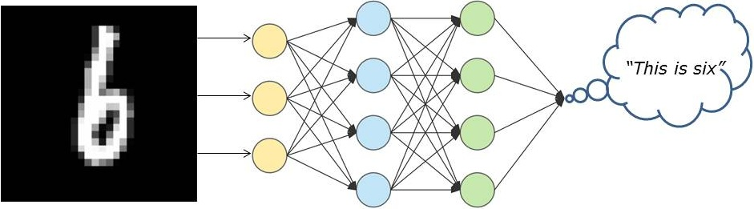

# Hndwritten Digit Recognition with Neural Network

</img>

This repository contains implementation of dense neural network in NumPy for handwritten digit recognition. For training the network MNIST database was used. Notebook ```neural_network_model``` have detailed description of implementation, while ```neural_netowork_model_code``` is just pure code. 

## Technologies:
* Programming Language: Python
* Pacages: NumPy, Pandas, Matplotlib, Imageio, Scikit-Image

## Data Source:
https://pjreddie.com/projects/mnist-in-csv/
